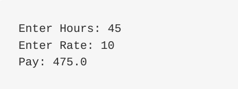

# 不定期更新的Python练习题
  一些练习题会上传在这里，请不要在这个文件夹里上传自己的代码


## Q1 工资计算

输入工作时长，输入单位时间工资，如果工作时长大于40小时，超出的部分按照1.5倍工资计算，计算总工资

输入输出要求: 屏幕输入 屏幕打印 

例子:



预计完成时间: 10min

请大家提交到 ```SwimmingPool/Questions Submit/Q1```

# Q2

请下载text.txt 文件，用python 读入文本文档，

首先将文本文档中所有的字母变成小写字母（文档中已经没有了标点符号），

然后对文档中每个出现的词进行词频统计，将每个词的词频存入list 中，

最后将list中最大的十个数字打印出来(考虑重复数字)。

**请在submit/Q2/ 文件夹中提交你的代码**
